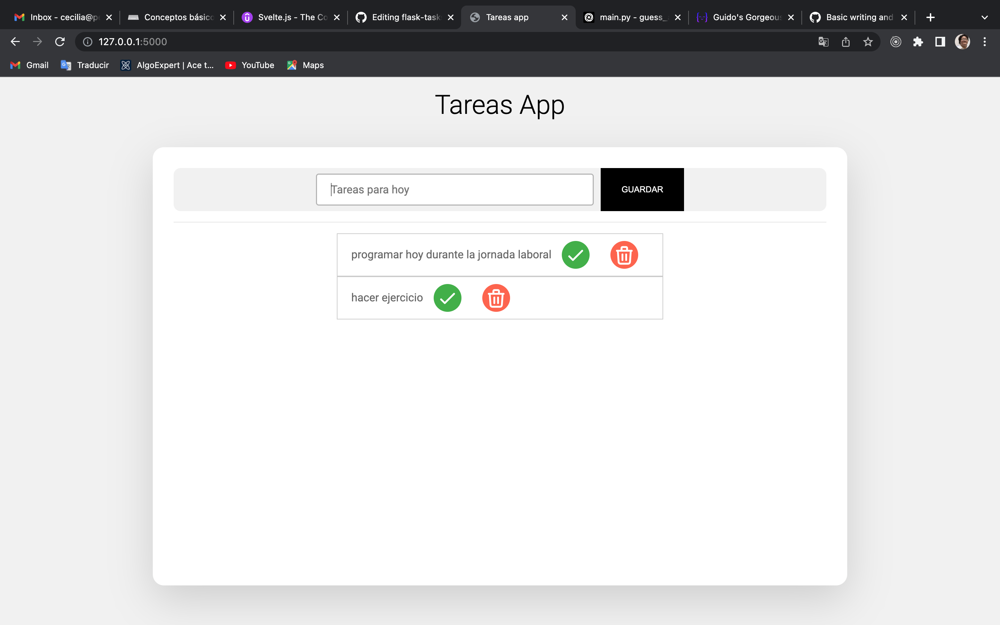

# Tareas App

#### demo

[video demo link](https://www.youtube.com/watch?v=zWLDyE4XAhE)

#### before running the app
- `pip install flask`
- `pip install requests` 
- `pip install SQLAlchemy`

#### run
- `flask run`
- go to the *port* that your terminal indicates
